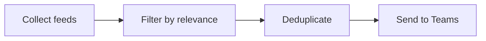

<div align="center">

# 🛡️ NewsBot

### Canadian Defence & Sovereignty News Aggregator

Automatically collects defence and sovereignty news from Canadian government feeds,
think tanks, major media, and Google News — then delivers a clean, deduplicated
digest to Microsoft Teams twice a day.

[](https://www.python.org/)
[](.github/workflows/newsbot.yml)
[](#-license)

</div>

---

## 📑 Table of Contents

- [Overview](#-overview)
- [How It Works](#-how-it-works)
- [Features](#-features)
- [Quick Start](#-quick-start)
- [Automated Deployment](#-automated-deployment-github-actions)
- [Command-Line Usage](#-command-line-usage)
- [Configuration](#-configuration)
- [Project Structure](#-project-structure)
- [License](#-license)

---

## 📰 Overview

NewsBot scans dozens of Canadian sources for news about defence, security, and
sovereignty, scores each article for relevance, removes anything you've already
seen, and posts the rest to a Microsoft Teams channel as a polished Adaptive Card.

It runs entirely on free infrastructure — GitHub Actions for scheduling and a
Teams Workflows webhook for delivery — so there are no servers to maintain and
no paid services required.

---

## ⚙️ How It Works

The pipeline runs in four stages:



| Stage | Module | What it does |
|-------|--------|--------------|
| **1. Collect** | `feed_collector.py` | Fetches and parses every configured RSS/Atom feed and Google News query, normalizing them into `Article` objects. |
| **2. Filter** | `keyword_filter.py` | Scores each article with a three-layer relevance model (see [Tuning Keywords](#tuning-keywords)). |
| **3. Deduplicate** | `dedup.py` | Tracks every sent article in SQLite so nothing is ever delivered twice. |
| **4. Send** | `teams_sender.py` | Formats the survivors into a grouped Adaptive Card and POSTs it to the Teams webhook. |

`main.py` orchestrates the stages and provides the command-line interface.

---

## ✨ Features

- **Multi-source collection** — Canadian government feeds (DND, Global Affairs, NSERC, CSA, IDEaS, ISED, and more), think tanks (CDA Institute, Macdonald-Laurier, NAADSN, CIC), major media (CBC, CTV, Global News, National Post, Globe and Mail), 18 targeted Google News queries, and optional LinkedIn feeds via RSS.app.
- **Smart relevance filtering** — A three-layer scoring model (primary topic → Canada relevance → domain context) with negative-keyword exclusion, so you get defence news, not hockey "defence."
- **Reliable deduplication** — SQLite-backed tracking by URL hash, plus cross-source title matching to collapse the same story found by multiple queries.
- **Clean Teams delivery** — Articles grouped by source type in a numbered, clickable Adaptive Card, posted through a free Teams Workflows webhook.
- **Hands-off automation** — GitHub Actions runs the bot every 12 hours; no servers required.
- **Fully configurable** — All sources, keywords, and scoring thresholds live in plain YAML.

---

## 🚀 Quick Start

### 1. Install dependencies

```bash
python -m venv .venv
source .venv/bin/activate        # Windows: .venv\Scripts\activate
pip install -r requirements.txt
```

### 2. Configure the Teams webhook

```bash
cp .env.example .env
# Edit .env and paste your Teams webhook URL
```

To create a Teams webhook (free, no premium plan required):

1. In Teams, click **⋯** next to the target channel → **Workflows**.
2. Choose **"Post to a channel when a webhook request is received."**
3. Name it (e.g. *NewsBot*) and finish the prompts.
4. Copy the generated webhook URL into `.env` as `TEAMS_WEBHOOK_URL`.

### 3. Preview locally (no message sent)

```bash
python -m src.main --dry-run
```

### 4. Send to Teams

```bash
python -m src.main
```

---

## 🤖 Automated Deployment (GitHub Actions)

The included workflow (`.github/workflows/newsbot.yml`) runs the bot on a schedule
with zero infrastructure.

1. **Push the repository to GitHub** (already done if you're reading this there).
2. **Add your webhook as a secret:** repo **Settings → Secrets and variables → Actions → New repository secret**.
   - Name: `TEAMS_WEBHOOK_URL`
   - Value: your full webhook URL
3. **Done.** The workflow runs automatically twice a day:

   | Schedule | UTC (cron) |
   |----------|------------|
   | 9:00 AM EST | `0 14 * * *` |
   | 9:00 PM EST | `0 2 * * *` |

You can also trigger it on demand from the **Actions** tab → **NewsBot** → **Run workflow**.

> **Note:** Cron times are fixed to UTC, so the local clock time shifts by an hour during daylight saving. Adjust the cron expressions in the workflow if you need exact local times year-round.

---

## 💻 Command-Line Usage

```text
python -m src.main [options]

Options:
  --dry-run            Collect and preview articles without sending to Teams
  --schedule [HH:MM]   Run continuously, firing daily at HH:MM (default: 07:00)
  --max-age HOURS      Maximum article age to consider, in hours (default: 48)
  --verbose, -v        Enable debug logging
  --stats              Show deduplication database statistics
```

Examples:

```bash
python -m src.main --dry-run          # Preview today's digest
python -m src.main                     # Collect and send to Teams
python -m src.main --schedule 08:00    # Run daily at 8:00 AM (local time)
python -m src.main --stats             # Inspect the dedup database
```

---

## 🔧 Configuration

### Adding or Removing Sources

Edit `config/sources.yaml`. Each source category is a simple list — append or
remove entries as needed:

- **`government`** — Canada.ca, DND, NSERC, Global Affairs, CSA, IDEaS, ISED, …
- **`think_tanks`** — CDA Institute, Macdonald-Laurier, NAADSN, CIC
- **`media`** — CBC (Politics / Canada / Tech), CTV, Global News, National Post, Globe and Mail
- **`google_news_queries`** — keyword searches covering defence research, the Arctic, quantum, procurement, NORAD, and more
- **`linkedin_rss`** *(optional)* — RSS.app feeds for LinkedIn pages

### Tuning Keywords

Edit `config/keywords.yaml`. The filter applies a three-layer model:

1. **`primary_keywords`** — the topics you care about; an article must match at least one.
2. **`canada_keywords`** — Canada relevance check, so non-trusted sources can't slip in foreign defence news.
3. **`context_keywords`** — domain validation that proves the article is about defence, not an unrelated mention.

Trusted source categories (`trusted_categories`) skip layers 2 and 3.
`negative_keywords` instantly disqualify false positives (sports, entertainment, etc.),
and the `scoring` block controls title weighting and the minimum score per source tier.

---

## 📁 Project Structure

```text
NewsBot/
├── .github/workflows/
│   └── newsbot.yml         # GitHub Actions schedule (every 12 hours)
├── config/
│   ├── sources.yaml        # RSS feed URLs and Google News queries
│   └── keywords.yaml       # Keywords, context validation, and scoring
├── src/
│   ├── main.py             # CLI, orchestrator, and scheduler
│   ├── feed_collector.py   # RSS/Atom fetching and parsing
│   ├── keyword_filter.py   # Three-layer relevance scoring
│   ├── dedup.py            # SQLite duplicate tracking
│   └── teams_sender.py     # Teams Adaptive Card formatting
├── data/                   # Auto-created DB + logs (git-ignored)
├── .env.example            # Template for your .env
├── requirements.txt
└── README.md
```

---

## 📄 License

Released under the [MIT License](https://opensource.org/licenses/MIT).
